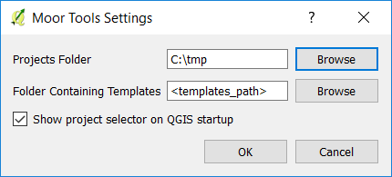
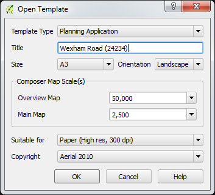

# Moor Tools (QGIS Plugin)

Tools for simplifying and automating common tasks for national parks and other protected areas. Catchy name courtesy of Dartmoor National Park, UK.

## Status

Although fully functional, this plugin has not yet been polished for release to the official QGIS plugin repository.

Please note this plugin has been developed for very specific use cases and as such may require further work to make it more generic to suit users' wider requirements. Please feel free to create GitHub *issues* for reporting any bugs, queries or feature requests.

## Configuration

Moor Tools can be configured from within QGIS via Plugins Menu > Moor Tools > Configure Moor Tools.

 

### Projects Folder (Project Selector)

The _Projects Folder_ configuration option should point to a folder containing QGIS project files (.qgs files) which will be presented to the user on QGIS start-up. 

Normally the first item in the _Project Selector_ dialog will be selected by default. To adjust this behaviour create a file called ``default.txt`` under the _Projects Folder_. In this file specify the name of the default project.  

### Folder Containing Templates (Template Selector)

The _Template Selector_ simplifies the process of selecting and configuring QGIS print composer templates (.qpt files) and provides a dialog like this:

The _Folder Containing Templates_ configuration option specifies the path to a folder containing the .qpt files. The folder structure should look similar to the example below:

- top-level container folder
	- Planning Application
		- A4L.qpt
		- A4P.qpt
		- A3L.qpt
		- images (folder)
			- logo.gif
		- Copyrights (folder)
			- Ordnance Survey.txt
			- Aerial 2010.txt
			- default.txt
	- Environmental Impact Assessment
		- ... (similar content to previous example

The names of the folders under the top-level container folder (e.g. _Planning Application_) are used to identify the type of print composer template (see image above).

In the example above the _Planning Application_ template is available as A4 (Landscape and Portrait) and A3 (Landscape). All ISO A series sizes are supported.

In this case the The optional _images_ folder contains any logos or other images referenced by the associated .qpt files. 

The optional _Copyrights_ folder contains the copyright text(s) available when using the _Planning Application_ composer template. _default.txt_ can optionally be used to specify the default copyright text for the template. This is configured as described above for the _Project Selector_.

### Customising the Help URL

You may be using Moor Tools as part of a wider QGIS deployment. In this case you may wish to override the destination URL of the Help button with your own content. This can be achieved by altering the definition of ``helpUrl`` towards the bottom of _templateselectordialog.py_

## Creating Templates

_Template Selector_ supports automatic replacement of strings in addition to those already supported by QGIS. The following strings will automatically be replaced within composer templates:

- [username] : the user's username (e.g. %USERNAME%)
- [title] : The _Title_ specified by the user in the above dialog
- [copyright] : The content of the selected copyright file   

Templates with multiple composer maps are supported. Composer maps are identified by their _Item ID_ property wherever present. 

## Troubleshooting

### Images Loading as Red Crosses

This can happen when references to files used in print composer templates have been saved using relative paths.

This can be resolved by:

1. QGIS > Project Properties > General tab > Save paths > absolute
2. Re-saving the composer template

Alternatively the .qpt file can be edited by hand to specify the absolute path to referenced files. 
